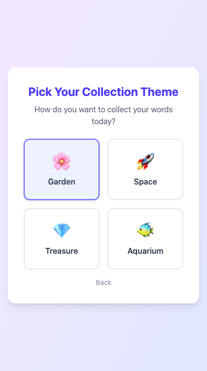

# Spelling Word Collector

**A spelling practice app for kids who'd rather do literally anything else.**

You know the drill. It's Tuesday night. The spelling test is Thursday. Your kid is staring at a list of 20 words like it's a sentencing document. You've tried flashcards (boring), writing each word five times (cruel and unusual), and that one app that buzzes angrily every time they get a word wrong (tears were involved).

Spelling Word Collector takes a different approach: **no real-time grading, no red Xs, no wrong-answer buzzers.** Kids "collect" words during practice — every attempt gets a flower in their garden, a star in their constellation, a gem in their treasure chest. Then you sit down together afterward to review. It's spelling practice that doesn't feel like a pop quiz.

---

## How It Works

### 1. Set Up Your Word List

Parents enter the week's spelling words. You can optionally add context sentences manually, or let **Claude AI generate them** for you (because you've got enough to do already).

<p align="center">
  
</p>

### 2. Pick a Theme

Your kid picks how they want to collect words today. Garden? Space? Treasure chest? Aquarium? It's their call. This is the one decision in their evening they actually get to make.

<p align="center">
  
</p>

### 3. Practice (the Stress-Free Kind)

The app reads each word aloud (text-to-speech), your kid types what they hear, and hits "Next Word." That's it. No judgment, no scoring, no red ink. Every word they type gets collected — right or wrong. The garden fills up with flowers, the stars appear in the sky, the treasure chest fills with gems.

<p align="center">
  
</p>

### 4. Review Together

After collecting all the words, you sit down together for review. Words they got right are already "bloomed" (green checkmark, everyone's happy). Words that need work show the correct spelling and a "Fix" button — they retype it, the flower blooms, and everyone moves on with their lives.

<p align="center">
  
</p>

No tears. No fights. Just a garden full of flowers and a kid who actually wants to practice again tomorrow.

---

## Features

- **Multiple collection themes** — Garden, Space, Treasure, and Aquarium (because variety is the spice of spelling)
- **Text-to-speech** — Words are read aloud so kids can practice independently
- **AI-generated context sentences** — Claude Haiku writes age-appropriate example sentences so you don't have to
- **Multiple practice modes** — Standard (listen & type) and Letter Scramble (unscramble mode)
- **Family sync** — Data syncs across devices via Firebase. Practice on the iPad, review on the laptop
- **Multiple profiles** — Got more than one kid? Each gets their own profile and practice history
- **Join codes** — Invite family members by email with rotating join codes
- **Practice streaks** — Track consecutive practice days (gentle motivation, not guilt)
- **Session history** — See past practice sessions and progress over time
- **Print words** — Old-school option for those who still believe in paper
- **PIN-protected admin** — Keep the settings safe from tiny curious fingers

---

## Getting Started

### Prerequisites

- Node.js 18+
- A Firebase project (Firestore + Hosting + Cloud Functions)
- An Anthropic API key (for AI sentence generation — optional but recommended)

### Installation

```bash
# Clone the repo
git clone https://github.com/nathanhbsimmons/spellingbee.git
cd spellingbee

# Install dependencies
npm install

# Install Cloud Functions dependencies
cd functions && npm install && cd ..

# Start the dev server
npm run dev
```

### Firebase Setup

1. Create a Firebase project at [console.firebase.google.com](https://console.firebase.google.com)
2. Enable Firestore Database
3. Copy your Firebase config into `src/firebase.js`
4. Set up Cloud Functions environment:

```bash
# In the functions/ directory, create a .env file:
GMAIL_EMAIL=your-email@gmail.com
GMAIL_APP_PASSWORD=your-app-password
ANTHROPIC_API_KEY=your-api-key  # Optional, for AI sentences
```

5. Deploy:

```bash
npm run build
firebase deploy
```

### Running Tests

```bash
npm test           # Run once
npm run test:watch # Watch mode
```

---

## Tech Stack

| Layer | Tech |
|-------|------|
| Frontend | React 19 + Vite |
| Styling | Tailwind CSS 4 |
| Database | Firebase Firestore |
| Hosting | Firebase Hosting |
| Backend | Firebase Cloud Functions (Node 22) |
| AI | Anthropic Claude Haiku (context sentences) |
| Auth | Family join codes (email-based) |
| Testing | Vitest + React Testing Library |

---

## Project Structure

```
spellingbee/
├── src/
│   ├── components/
│   │   ├── AdminPanel.jsx      # Word list management, settings, email config
│   │   ├── WordListSetup.jsx   # Home hub — practice, history, settings
│   │   ├── PracticeMode.jsx    # The main practice experience
│   │   ├── ReviewMode.jsx      # Post-practice review with parent
│   │   ├── ProfileSelector.jsx # Multi-kid profile management
│   │   └── ThemeSelector.jsx   # Garden/Space/Treasure/Aquarium picker
│   ├── themes/                 # SVG-based collection themes
│   ├── db.js                   # Firestore data layer
│   ├── firebase.js             # Firebase config
│   └── App.jsx                 # Main app routing and state
├── functions/
│   ├── index.js                # Cloud Functions (email, AI sentences)
│   └── utils/emailService.js   # Email delivery via Gmail
├── docs/screenshots/           # App screenshots
└── firestore.rules             # Security rules
```

---

## Why This Exists

My daughter was in tears over spelling practice. The existing apps all did the same thing: show a word, make the kid type it, then flash a big red X when they got it wrong. Great for building resilience, maybe. Terrible for building a love of learning.

So I built something different. The core insight is simple: **separate the practice from the evaluation.** Let kids engage with the words freely during practice, then review accuracy together afterward in a supportive context. It turns out that when you remove the fear of being wrong, kids are a lot more willing to practice.

If your kid's relationship with spelling homework looks anything like mine did, give this a try.

---

## License

MIT
